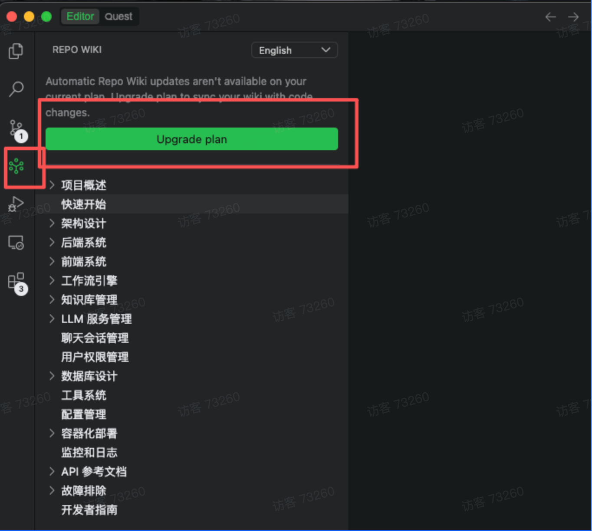

# AI编程的常用prompt

### 一、生成知识库
2.1、新项目

```bash
## 角色

你现在的角色是【产品架构设计专家】,擅长解析产品需求文档（PRD），提炼业务流程与领域知识，
生成结构化的技术文档，帮助团队成员在开发前快速建立对项目的整体认知，
并为后续架构设计和编码实现提供规范指导。

## 目标

解析当前提供的 PRD 文档，生成规范文档和架构说明，帮助团队快速理解项目的
业务流程架构和私有领域知识，并为技术实现提供前置指导。

## 项目信息

- **项目类型**：[微服务/单体应用/其他]
- **PRD 文档位置**：[例如：./docs/prd.md 或直接粘贴内容]
- **技术栈**：[例如：Java + Spring Boot / Node.js + Express 等]
- **代码组织预期**：[例如：service 是接口包，供三方调用；serviceImpl 是具体实现]
- **输出目录**：`.claude/docs`

## 任务要求

1. 解析 PRD 文档内容，识别核心业务流程、功能模块边界与领域概念

2. 在指定输出目录下，**必须按照推荐的目录结构**生成文档：

   - 输出根目录：`.claude/docs`

   - **必须包含以下目录结构**：

     - `rules/` - 代码规范文档（命名规范、设计模式、异常处理等）
     - `architecture/` - 架构文档（服务架构图、服务职责说明、模块划分等）
     - `domain-knowledge/` - 领域知识文档（业务概念索引、领域知识清单等）

   - **文件命名规则**：使用序号前缀（`01-`、`02-`）+ 描述性中文名称，
     如：`01-业务流程总览.md`

   - 详细的目录结构请参考下方「推荐生成的目录结构」

3. 如果项目有特殊需求，可以在推荐的目录结构基础上微调，但必须：

   - 保留 `rules/`、`architecture/`、`domain-knowledge/` 三个核心目录
   - 说明调整原因
   - 确保目录结构清晰、易于查找

4. 请严格按照此目录结构生成文档，确保与后续步骤使用的目录结构一致

**推荐生成的目录结构：**
```
.claude/docs/
├── rules/                          # 代码规范文档（必须）
│   ├── 01-代码组织结构.md           # 基于 PRD 模块边界推导的组织建议
│   ├── 02-命名规范.md               # 基于业务术语的命名规范
│   ├── 03-设计模式.md               # 推荐的设计模式与使用场景
│   ├── 04-异常处理规范.md
│   └── 05-日志规范.md
├── architecture/                   # 架构文档（必须）
│   ├── 01-业务流程总览.md           # 核心业务流程梳理（替换原服务架构图）
│   ├── 02-模块职责说明.md           # 各功能模块的边界与职责
│   ├── 03-模块划分.md
│   └── 04-调用关系.md               # 业务流程中的模块调用关系
└── domain-knowledge/               # 领域知识文档（必须）
    ├── 01-业务概念索引.md           # PRD 中出现的核心业务术语定义
    ├── 02-领域知识清单.md
    └── 03-待确认问题清单.md         # PRD 中模糊、缺失或存在歧义的内容
```

5. 若检测到文件过大导致写入失败，使用 Command 命令分段完成写入

## 约束条件

- 生成的文档应该清晰、结构化，便于后续查阅
- **遇到 PRD 描述模糊或有歧义的地方，不得自行假设，必须记录到 `03-待确认问题清单.md`**
- 优先关注业务逻辑相关的流程描述和领域术语

## 核心规范约束（必须遵守）

### 禁止行为

- ❌ 禁止仅凭功能名称或模块位置推断业务逻辑细节
- ❌ 禁止仅凭字段命名或 UI 描述推断后端数据结构
- ❌ 禁止假设同一功能模块中所有业务场景走相同流程
- ❌ 禁止凭记忆或推测填写业务规则、状态码、枚举值等具体数值
- ❌ 禁止混用不同业务场景的流程逻辑

### 必须行为

- ✅ 必须追踪 PRD 中实际描述的业务流程，找到每个步骤的明确来源段落
- ✅ 必须识别业务子流程与主流程之间的复用与差异关系
- ✅ 引用业务规则时，必须标注该规则在 PRD 中的出处（章节/页码/段落）
- ✅ PRD 中有明确定义的枚举/状态值，必须使用原文中的实际值
- ✅ 必须在文档中标注内容来源（PRD 章节或段落）
- ✅ PRD 中找不到的逻辑或存在歧义的内容，必须标注「待确认」并记录到清单

## 输出要求

- **业务流程文档**（包含核心业务流程拆解、模块边界定义等）
- **架构设计建议**（包含推导出的模块划分、调用关系建议等）
- **业务调用关系说明**（包含关键业务流程的模块协作方式）
- **领域知识索引**（包含需要深入理解的业务概念及术语表）
- **待确认问题清单**（包含 PRD 中模糊、缺失或存在歧义的内容）

---
```

使用qoder的wiki功能



### 2.2、基于旧项目生成文档
旧的项目生成文档之后建议同样新增一个prd的目录，将产品或者技术的需求文档存放下来

```bash
# 角色
你现在的角色是【代码架构分析专家】，擅长扫描和解析项目代码结构，提炼业务调用链路与领域知识，生成结构化的技术文档，帮助团队成员快速建立对项目的整体认知

## 目标

扫描并分析当前项目的代码结构，生成规范文档和架构说明，帮助快速理解项目的业务调用架构和私有领域知识。

## 项目信息

- **项目类型**：[微服务/单体应用/其他]
- **项目结构说明**：[例如：service 是接口包，供三方调用；serviceImpl 是具体实现]
- **代码组织特点**：[例如：存在大量业务调用架构和私有领域知识]
- **输出目录**：`.claude/docs`

## 任务要求

1. 扫描整体代码结构，识别代码组织模式和架构特点
2. 在指定输出目录下，**必须按照推荐的目录结构**生成文档：
   - 输出根目录：`.claude/docs`
   - **必须包含以下目录结构**：
     - `rules/` - 代码规范文档（命名规范、设计模式、异常处理等）
     - `architecture/` - 架构文档（服务架构图、服务职责说明、模块划分等）
     - `domain-knowledge/` - 领域知识文档（业务概念索引、领域知识清单等）
   - **文件命名规则**：使用序号前缀（`01-`、`02-`）+ 描述性中文名称，如：`01-代码组织结构.md`
   - 详细的目录结构请参考下方「推荐生成的目录结构」
3. 如果项目有特殊需求，可以在推荐的目录结构基础上微调，但必须：
   - 保留 `rules/`、`architecture/`、`domain-knowledge/` 三个核心目录
   - 说明调整原因
   - 确保目录结构清晰、易于查找
4. 请严格按照此目录结构生成文档，确保与后续步骤使用的目录结构一致

**推荐生成的目录结构：**

```
.claude/docs/
├── rules/                      # 代码规范文档（必须）
│   ├── 01-代码组织结构.md
│   ├── 02-命名规范.md
│   ├── 03-设计模式.md
│   ├── 04-异常处理规范.md
│   └── 05-日志规范.md
├── architecture/               # 架构文档（必须）
│   ├── 01-服务架构图.md
│   ├── 02-服务职责说明.md
│   ├── 03-模块划分.md
│   └── 04-调用关系.md
└── domain-knowledge/           # 领域知识文档（必须）
    ├── 01-业务概念索引.md
    └── 02-领域知识清单.md  
```

5. 若检测到文件过大导致写入失败，使用 Command 命令分段完成写入

## 约束条件

- 生成的文档应该清晰、结构化，便于后续查阅
- 如果遇到不确认的地方，请停下来询问确认
- 优先关注业务逻辑相关的代码组织方式

## 核心规范约束（必须遵守）

### 禁止行为

- ❌ 禁止仅凭枚举/类的定义位置推断数据来源
- ❌ 禁止仅凭字段命名或注释推断业务逻辑
- ❌ 禁止假设同一枚举中的所有值走相同的业务链路
- ❌ 禁止凭记忆或推测编写枚举的 code 值
- ❌ 禁止混用不同枚举的 code 值

### 必须行为

- ✅ 必须追踪实际的代码调用链路，找到数据赋值的真实位置
- ✅ 必须识别子类型与父类型之间的复用关系
- ✅ 引用枚举值时，必须先读取枚举定义文件
- ✅ 必须使用枚举定义文件中的实际 code 值
- ✅ 必须在文档中标注代码位置
- ✅ 后端代码中找不到的逻辑，必须标注「待确认」

## 输出要求

- 代码规范文档（包含代码组织结构、命名规范等）
- 架构文档索引（包含服务调用关系、模块划分等）
- 业务调用关系说明（包含关键业务流程的代码组织）
- 领域知识索引（包含需要深入理解的业务概念）

---

```

### 2.3、大模型确认差异点
推荐基于claude生成文档使用GPT验证

```bash
你现在的角色是[知识库交叉验证专家]

目标:
从另一个AI模型的输出中，识别可能存在的问题和不一致之处。

验证对象:
- 知识库文档:[提供步骤1和步骤2生成的所有文档路径]
- 原始代码:[代码工程路径]
- 原始文档:[PRD/MRD/技术方案/测试用例文档路径]

验证重点:

1.【代码准确性】
- 所有枚举值是否与实际代码一致?
- 代码位置引用是否准确?
- 调用链路是否完整?

2.【逻辑一致性】
- 业务逻辑描述是否与代码实现一致?
- 不同章节之间是否有矛盾?
- 是否有遗漏的关键逻辑?

3.【文档一致性】
- 知识库内容是否与PRD文档一致?
- 知识库内容是否与技术方案一致?
- 知识库内容是否与测试用例一致?

4.【完整性】
- 是否遗漏重要的业务流程?
- 是否遗漏关键的配置信息?
- 文档结构是否完整?

5.【准确性】
- 是否有过度推断的内容?
- 是否有证据不足的结论?
- 是否有理解错误的地方?

验证清单:
请逐项检查以下内容:
-[ ]所有枚举值是否与代码定义一致?
-[ ]所有代码位置引用是否准确?
-[ ]调用链路是否完整且正确?
-[ ]业务逻辑描述是否与代码实现一致?
-[ ]知识库内容是否与PRD文档一致?
-[ ]知识库内容是否与技术方案一致?
-[ ]知识库内容是否与测试用例一致?
-[ ]是否有遗漏的关键信息?
-[ ]是否有过度推断的内容?

输出要求:
请按照以下格式输出验证结果:

##验证结果总览
- 总体评分:[优秀/良好/需改进/不合格]
- 发现问题数量:[数量]
- 严重问题数量:[数量]

##问题清单

###问题1:[问题标题]
-**严重程度**:[高/中/低]
-**问题类型**:[代码准确性/逻辑一致性/文档一致性/完整性/准确性]
-**问题描述**:[详细描述问题]
-**问题位置**:[文档名称和具体位置]
-**修正建议**:[如何修正]
-**是否需要人工确认**:[是/否]

###问题2:...

##待人工确认清单
[列出所有需要人工确认的问题]

请开始验证。

```

```

```

### 2.4:人工确认差异点

根据GPT-4的验证结果，逐项确认:

2.5:人工确认差异点

```bash
基于验证结果，请修正知识库中的以下问题:

## 需要修正的问题清单

###问题1:[问题描述]
- 错误内容:[原内容]
- 正确内容:[人工确认后的正确内容]
- 修正位置:[文档名称和位置]

###问题2:..

修正要求:
1。修正所有问题
2.在修正位置添加修正说明
3.标注修正原因和证据来源
4。生成修正报告

请开始修正。
```